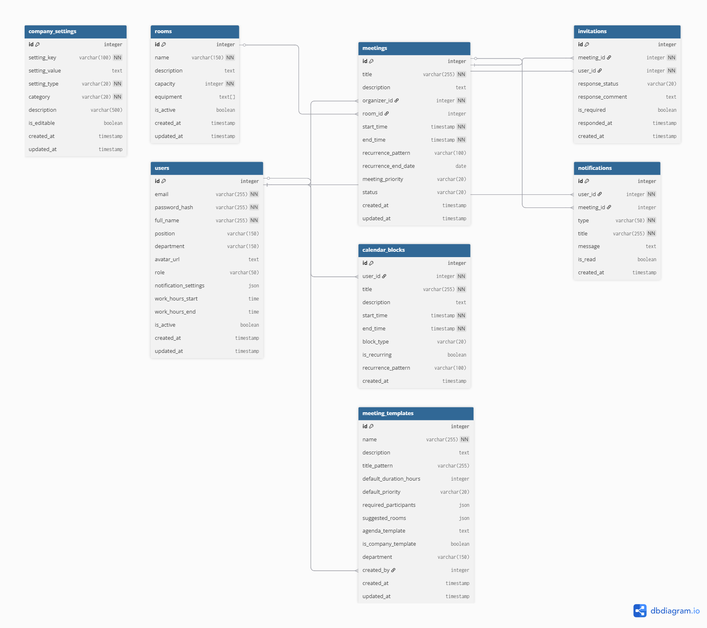

## Команда: WhiteKod

# Техническое задание на разработку программного продукта для планирования встреч

## 1. Общие описание
Необходимо разработать программный продукт для планирования встреч сотрудников внутри компании. Система состоит из клиентского мобильного приложения и серверной части.

## 2. Клиентская часть (Android-приложение)
Клиентом является **Android-приложение**, которое должно быть реализовано на **Kotlin** или **Java** с использованием **адаптивной верстки**.

Приложение должно предоставлять интуитивно понятный интерфейс, в котором реализован следующий функционал:

*   **Регистрация и авторизация** сотрудника.
*   **Настройка личного профиля**.
*   **Создание встречи** с возможностью приглашения других сотрудников. Приглашенные сотрудники должны иметь возможность дать бинарный ответ (**принял** / **не принял**).
*   **Просмотр списка активных приглашений** на встречи с возможностью дать ответ о возможности посещения.
*   **Просмотр собственного расписания встреч** в разрезе дня, недели и месяца.

**Важное условие:** временные слоты для встреч разбиты строго по часам. Например, можно создать встречу на 9:00–10:00, но создание встречи на 9:10, 9:05 и т.д. — невозможно.

## 3. Серверная часть
Сервер представляет собой **микросервис на Spring Boot**, работающий с СУБД **PostgreSQL** или **H2**.

Серверное приложение должно:
*   Предоставлять API, необходимый для полноценной работы мобильного приложения.
*   Осуществлять все основные операции с данными в базе через **Spring Data JPA**.
*   Использовать **Liquibase** для создания схемы базы данных и ее предзаполнения.

## User Stories 
1. Как новый сотрудник, я хочу зарегистрироваться в приложении, чтобы получить доступ к системе планирования встреч.
2. Как сотрудник, я хочу войти в приложение под своим аккаунтом, чтобы получить доступ к своему расписанию.
3. Как сотрудник, я хочу редактировать свой профиль (ФИО, должность, аватар), чтобы актуализировать информацию о себе.
4. Как сотрудник, я хочу создать новую встречу, чтобы организовать обсуждение с коллегами.
5. Как сотрудник, я хочу выбирать участников встречи из списка сотрудников, чтобы пригласить нужных людей.
6. Как сотрудник, я хочу искать сотрудников по имени или отделу при создании встречи, чтобы быстро найти нужных участников.
7. Как сотрудник, я хочу выбирать дату и время встречи только целыми часами (9:00, 10:00 и т.д.), чтобы соответствовать корпоративному формату.
8. Как сотрудник, я хочу видеть занятые слоты участников при планировании встречи, чтобы избежать конфликтов расписания.
9. Как сотрудник, я хочу просматривать свои встречи в виде дня, чтобы видеть детальное расписание на текущий день.
10. Как сотрудник, я хочу просматривать свои встречи в виде недели, чтобы оценить загруженность на неделе.
11. Как сотрудник, я хочу просматривать свои встречи в виде месяца, чтобы видеть общую картину встреч.
12. Как сотрудник, я хочу получать уведомления о новых приглашениях на встречи, чтобы оперативно реагировать.
13. Как сотрудник, я хочу видеть список входящих приглашений на встречи, чтобы управлять своими ответами.
14. Как сотрудник, я хочу принимать приглашение на встречу, чтобы подтвердить свое участие.
15. Как сотрудник, я хочу отклонять приглашение на встречу, чтобы освободить время для других задач.
16. Как сотрудник, я хочу видеть список исходящих приглашений, чтобы отслеживать статусы своих встреч.
17. Как сотрудник, я хочу изменять уже созданную встречу (время, участники, описание), чтобы скорректировать детали.
18. Как сотрудник, я хочу отменять созданную мной встречу, чтобы освободить время всем участникам.
19. Как сотрудник, я хочу получать уведомления об изменении встречи, в которой я участвую, чтобы быть в курсе изменений.
20. Как сотрудник, я хочу получать уведомления об отмене встречи, в которой я участвую, чтобы скорректировать свои планы.
21. Как сотрудник, я хочу видеть детальную информацию о встрече (участники, описание, место), чтобы подготовиться к ней.
22. Как сотрудник, я хочу добавлять описание к встрече при создании, чтобы участники понимали повестку.
23. Как сотрудник, я хочу указывать место проведения встречи, чтобы участники знали, где собираться.
24. Как сотрудник, я хочу видеть статус подтверждения каждого участника встречи, чтобы понимать, кто придет.
25. Как сотрудник, я хочу фильтровать список встреч по статусу (предстоящие, прошедшие), чтобы легко находить нужные.
26. Как сотрудник, я хочу искать встречи по названию или участникам, чтобы быстро найти конкретную встречу.
27. Как сотрудник, я хочу переключаться между светлой и темной темой приложения, чтобы комфортно работать при разном освещении.
28. Как сотрудник, я хочу видеть конфликты в расписании при создании встречи, чтобы выбирать время, удобное всем.
29. Как сотрудник, я хочу быстро создавать встречу, тапнув на свободный слот в календаре, чтобы ускорить процесс планирования.
30. Как сотрудник, я хочу дублировать уже существующую встречу, чтобы создать похожую без заполнения всех полей.
31. Как сотрудник, я хочу выходить из своего аккаунта, чтобы обеспечить безопасность данных при использовании общего устройства.
32. Как сотрудник, я хочу просматривать профили других сотрудников (ФИО, должность, отдел), чтобы знать, с кем планирую встречу.
33. Как сотрудник, я хочу получать напоминания о предстоящих встречах за определенное время (15/30/60 минут), чтобы не опаздывать.
34. Как сотрудник, я хочу настраивать параметры уведомлений (типы, звук), чтобы контролировать поток оповещений.
35. Как сотрудник, я хочу синхронизировать встречи с календарем устройства, чтобы видеть все события в одном месте.
36. Как сотрудник, я хочу экспортировать информацию о встрече (дата, время, участники), чтобы поделиться с внешними лицами.
37. Как сотрудник, я хочу создавать повторяющиеся встречи (ежедневные, еженедельные), чтобы не создавать одинаковые встречи каждый раз.
38. Как сотрудник, я хочу видеть историю изменений встречи, чтобы отслеживать, что и когда менялось.
39. Как сотрудник, я хочу добавлять вложения или ссылки к описанию встречи, чтобы участники имели доступ к материалам заранее.
40. Как сотрудник, я хочу видеть свое расписание в режиме "только рабочие часы", чтобы фокусироваться на рабочем времени.
41. Как сотрудник, я хочу блокировать определенные часы в своем календаре как "недоступные", чтобы избежать нежелательных приглашений.
42. Как сотрудник, я хочу видеть статистику своих встреч (количество в неделю/месяц, средняя продолжительность), чтобы анализировать загрузку.
43. Как сотрудник, я хочу делиться своим календарем (полностью или частично) с другими сотрудниками, чтобы упростить согласование времени.
44. Как сотрудник, я хочу устанавливать приоритет встречи (высокий, средний, низкий), чтобы выделять важные события в календаре.
45. Как сотрудник, я хочу видеть встречи, где я являюсь обязательным участником, отдельно от optional встреч.
46. Как сотрудник, я хочу голосовать за варианты времени при планировании встречи с несколькими участниками, чтобы выбрать оптимальное время.
47. Как сотрудник, я хочу добавлять внешних участников (не сотрудников компании) к встрече с ограниченным доступом, чтобы проводить встречи с клиентами.
48. Как сотрудник, я хочу архивировать прошедшие встречи, чтобы не засорять активный календарь.
49. Как сотрудник, я хочу использовать быстрые шаблоны для часто проводимых встреч (например, "еженедельный стендап"), чтобы экономить время.
50. Как администратор системы, я хочу управлять учетными записями сотрудников (добавлять, деактивировать), чтобы поддерживать актуальность данных.
51. Как администратор системы, я хочу настраивать рабочие часы компании по умолчанию, чтобы ограничивать планирование встреч вне рабочего времени.
52. Как администратор системы, я хочу просматривать общую статистику по встречам в компании, чтобы анализировать активность сотрудников.
53. Как администратор системы, я хочу управлять конференц-залами и переговорками в приложении, чтобы учитывать доступность помещений при планировании.

## **User Cases**

---

## 1. Регистрация нового сотрудника
**Цель:** получить доступ к системе планирования встреч компании  
**Участники:** Новый сотрудник  
*Предусловия:*
- Сотрудник не имеет аккаунта в системе
- Получен инвайт от администратора или доступна публичная регистрация

*Основной поток:*
**1.** Пользователь открывает приложение  
**2.** Выбирает "Регистрация"  
**3.** Заполняет форму: email, ФИО, должность, отдел, пароль  
**4.** Подтверждает email через ссылку в письме  
**5.** Система создает аккаунт и перенаправляет на главный экран  

*Альтернативный поток:*
**A1.** Email уже используется: система предлагает восстановить пароль  
**A2.** Пароль не соответствует требованиям: система показывает правила  
**A3.** Инвайт-код неверный: система сообщает об ошибке  

---

## 2. Авторизация сотрудника
**Цель:** получить доступ к своему расписанию встреч  
**Участники:** Сотрудник  
*Предусловия:*
- У сотрудника есть активный аккаунт
- Приложение установлено на устройстве

*Основной поток:*
**1.** Пользователь открывает приложение  
**2.** Вводит email и пароль  
**3.** Нажимает "Войти"  
**4.** Система проверяет учетные данные  
**5.** При успехе перенаправляет на главный экран  

*Альтернативный поток:*
**A1.** Неверный пароль: система предлагает восстановить  
**A2.** Аккаунт не активирован: отправляет повторное письмо  
**A3.** Устройство новое: запрашивает двухфакторную аутентификацию  

---

## 3. Редактирование профиля сотрудника
**Цель:** актуализировать личную информацию в системе  
**Участники:** Сотрудник  
*Предусловия:*
- Сотрудник авторизован в системе
- Открыт экран профиля

*Основной поток:*
**1.** Пользователь переходит в раздел "Профиль"  
**2.** Нажимает "Редактировать"  
**3.** Изменяет данные: ФИО, должность, отдел, аватар  
**4.** Нажимает "Сохранить"  
**5.** Система обновляет информацию  

*Альтернативный поток:*
**A1.** Изменение email: требуется подтверждение  
**A2.** Сброс аватара: возврат к стандартному  
**A3.** Отмена редактирования: возврат к исходным данным  

---

## 4. Создание новой встречи
**Цель:** организовать обсуждение с коллегами  
**Участники:** Сотрудник-организатор  
*Предусловия:*
- Сотрудник авторизован
- Есть доступ к созданию встреч

*Основной поток:*
**1.** Пользователь нажимает "+" в нижней навигации  
**2.** Заполняет основные данные: название, описание  
**3.** Выбирает дату и время  
**4.** Выбирает участников  
**5.** Нажимает "Создать"  
**6.** Система отправляет приглашения  

*Альтернативный поток:*
**A1.** Конфликт времени: система предлагает альтернативы  
**A2.** Пустые обязательные поля: система подсвечивает ошибки  
**A3.** Сохранение черновика: временное сохранение без отправки  

---

## 5. Выбор участников встречи
**Цель:** пригласить нужных людей на встречу  
**Участники:** Сотрудник-организатор  
*Предусловия:*
- Открыта форма создания встречи
- В системе есть другие сотрудники

*Основной поток:*
**1.** На этапе создания встречи пользователь нажимает "Добавить участников"  
**2.** Система показывает список сотрудников с чекбоксами  
**3.** Пользователь отмечает нужных сотрудников  
**4.** Подтверждает выбор  
**5.** Система добавляет участников к встрече  

*Альтернативный поток:*
**A1.** Поиск по имени: фильтрация списка  
**A2.** Выбор группой: отметка всего отдела  
**A3.** Исключение участника: удаление из списка  

---

## 6. Поиск сотрудников при создании встречи
**Цель:** быстро найти нужных участников среди коллег  
**Участники:** Сотрудник-организатор  
*Предусловия:*
- Открыта форма добавления участников

*Основной поток:*
**1.** Пользователь вводит имя или фамилию в поисковую строку  
**2.** Система в реальном времени фильтрует список  
**3.** Пользователь видит релевантные результаты  
**4.** Выбирает нужных сотрудников из результатов  

*Альтернативный поток:*
**A1.** Поиск по отделу: фильтрация по структурному подразделению  
**A2.** Ничего не найдено: система предлагает уточнить запрос  
**A3.** Очистка поиска: возврат к полному списку  

---

## 7. Выбор часовых слотов для встречи
**Цель:** соответствовать корпоративному формату целых часов  
**Участники:** Сотрудник-организатор  
*Предусловия:*
- Открыта форма создания/редактирования встречи

*Основной поток:*
**1.** Пользователь выбирает дату встречи  
**2.** Система показывает доступные часовые слоты (9:00, 10:00, 11:00...)  
**3.** Пользователь выбирает начальное время  
**4.** Система автоматически устанавливает окончание через час  
**5.** Пользователь подтверждает выбор  

*Альтернативный поток:*
**A1.** Изменение продолжительности: выбор другого количества часов  
**A2.** Занятые слоты: система показывает недоступное время  
**A3.** Нестандартное время: система корректирует до ближайшего часа  

---

## 8. Просмотр занятых слотов участников
**Цель:** избежать конфликтов расписания при планировании  
**Участники:** Сотрудник-организатор  
*Предусловия:*
- Выбраны участники встречи
- Выбрана предполагаемая дата

*Основной поток:*
**1.** Пользователь выбирает дату и время для встречи  
**2.** Система проверяет доступность всех участников  
**3.** Если есть конфликты, система показывает предупреждение  
**4.** Пользователь видит список занятых участников и время их встреч  
**5.** Может выбрать другое время  

*Альтернативный поток:*
**A1.** Частичная доступность: система показывает, кто свободен  
**A2.** Автоподбор времени: система предлагает ближайшее свободное  
**A3.** Игнорирование конфликта: создание встречи несмотря на занятость  

---

## 9. Просмотр расписания в виде дня
**Цель:** видеть детальное расписание на текущий день  
**Участники:** Сотрудник  
*Предусловия:*
- Сотрудник авторизован
- Открыт раздел календаря

*Основной поток:*
**1.** Пользователь открывает календарь  
**2.** Выбирает режим "День"  
**3.** Система показывает вертикальную шкалу времени с 8:00 до 20:00  
**4.** Встречи отображаются как блоки в соответствующих слотах  
**5.** Пользователь может скроллить, чтобы увидеть весь день  

*Альтернативный поток:*
**A1.** Переход к другому дню: свайп влево/вправо  
**A2.** Быстрая навигация: тап на дате в заголовке  
**A3.** Просмотр деталей встречи: тап на блоке встречи  

---

## 10. Просмотр расписания в виде недели
**Цель:** оценить загруженность на неделю  
**Участники:** Сотрудник  
*Предусловия:*
- Сотрудник авторизован
- Открыт раздел календаря

*Основной поток:*
**1.** Пользователь открывает календарь  
**2.** Выбирает режим "Неделя"  
**3.** Система показывает сетку: дни по горизонтали, время по вертикали  
**4.** Встречи отображаются как компактные блоки в ячейках  
**5.** Пользователь видит всю неделю на одном экране  

*Альтернативный поток:*
**A1.** Изменение масштаба: увеличение/уменьшение временного диапазона  
**A2.** Переход к другой неделе: свайп вверх/вниз  
**A3.** Экспорт недели: сохранение расписания в файл  

---

## 11. Просмотр расписания в виде месяца
**Цель:** увидеть общую картину встреч в месяце  
**Участники:** Сотрудник  
*Предусловия:*
- Сотрудник авторизован
- Открыт раздел календаря

*Основной поток:*
**1.** Пользователь открывает календарь  
**2.** Выбирает режим "Месяц"  
**3.** Система показывает классический месячный календарь  
**4.** Дни с встречами помечены точками или цветом  
**5.** Пользователь видит 4-5 недель на одном экране  

*Альтернативный поток:*
**A1.** Переход к другому месяцу: свайп влево/вправо  
**A2.** Выбор даты: тап на дне → переход к виду "День"  
**A3.** Количество встреч: долгий тап показывает список встреч дня  

---

## 12. Получение уведомлений о приглашениях
**Цель:** оперативно реагировать на новые приглашения  
**Участники:** Сотрудник  
*Предусловия:*
- У сотрудника включены push-уведомления
- Есть активное интернет-соединение

*Основной поток:*
**1.** Организатор создает встречу с данным сотрудником  
**2.** Система отправляет push-уведомление  
**3.** Устройство сотрудника показывает уведомление  
**4.** Сотрудник видит заголовок, время, организатора  

*Альтернативный поток:*
**A1.** Отключенные уведомления: отправка email или SMS  
**A2.** Пропущенное уведомление: отображение в ленте при открытии приложения  
**A3.** Группировка уведомлений: несколько приглашений в одном  

---

## 13. Просмотр списка входящих приглашений
**Цель:** управлять своими ответами на приглашения  
**Участники:** Сотрудник  
*Предусловия:*
- Сотрудник авторизован
- Есть непросмотренные приглашения

*Основной поток:*
**1.** Пользователь открывает раздел "Приглашения"  
**2.** Система показывает список входящих приглашений  
**3.** Каждое приглашение содержит: название, время, организатор, статус  
**4.** Пользователь может фильтровать по статусу  
**5.** Пользователь выбирает приглашение для ответа  

*Альтернативный поток:*
**A1.** Просроченные приглашения: система помечает как "истекшие"  
**A2.** Массовый ответ: отметка нескольких приглашений  
**A3.** Поиск по приглашениям: фильтрация по названию или организатору  

---

## 14. Принятие приглашения на встречу
**Цель:** подтвердить свое участие во встрече  
**Участники:** Сотрудник  
*Предусловия:*
- Есть активное входящее приглашение
- Время встречи не конфликтует с существующими

*Основной поток:*
**1.** Пользователь открывает детали приглашения  
**2.** Нажимает кнопку "Принять"  
**3.** Система обновляет статус приглашения  
**4.** Отправляет уведомление организатору  
**5.** Добавляет встречу в календарь пользователя  

*Альтернативный поток:*
**A1.** Конфликт времени: система предлагает отклонить или предложить другое время  
**A2.** Условное принятие: принятие с комментарием  
**A3.** Принятие с напоминанием: установка дополнительного напоминания  

---

## 15. Отклонение приглашения на встречу
**Цель:** освободить время для других задач  
**Участники:** Сотрудник  
*Предусловия:*
- Есть активное входящее приглашение

*Основной поток:*
**1.** Пользователь открывает детали приглашения  
**2.** Нажимает кнопку "Отклонить"  
**3.** Система запрашивает причину (опционально)  
**4.** Обновляет статус приглашения  
**5.** Отправляет уведомление организатору  

*Альтернативный поток:*
**A1.** Мягкое отклонение: "Может быть" вместо категоричного отказа  
**A2.** Отклонение с предложением: альтернативное время или формат  
**A3.** Автоматическое отклонение: при конфликте с обязательной встречей  

---

## 16. Просмотр исходящих приглашений
**Цель:** отслеживать статусы созданных мной встреч  
**Участники:** Сотрудник-организатор  
*Предусловия:*
- Сотрудник создавал встречи ранее

*Основной поток:*
**1.** Пользователь открывает раздел "Приглашения"  
**2.** Переключается на вкладку "Исходящие"  
**3.** Система показывает список встреч, созданных пользователем  
**4.** По каждой встрече виден статус каждого приглашенного  
**5.** Пользователь может напомнить о приглашении  

*Альтернативный поток:*
**A1.** Фильтрация по статусу: показ только неответивших  
**A2.** Экспорт статусов: сохранение отчета по участникам  
**A3.** Массовое напоминание: отправка уведомления всем неответившим  

---

## 17. Изменение созданной встречи
**Цель:** скорректировать детали уже запланированной встречи  
**Участники:** Сотрудник-организатор  
*Предусловия:*
- Встреча создана пользователем
- Встреча еще не состоялась

*Основной поток:*
**1.** Пользователь открывает детали своей встречи  
**2.** Нажимает "Редактировать"  
**3.** Вносит изменения: время, участники, описание  
**4.** Подтверждает изменения  
**5.** Система отправляет уведомления участникам об изменениях  

*Альтернативный поток:*
**A1.** Изменение времени с конфликтом: система предупреждает о проблемах  
**A2.** Отмена редактирования: возврат к исходным данным  
**A3.** Частичное изменение: редактирование только некоторых полей  

---

## 18. Отмена созданной встречи
**Цель:** освободить время всем участникам  
**Участники:** Сотрудник-организатор  
*Предусловия:*
- Встреча создана пользователем
- Встреча еще не состоялась

*Основной поток:*
**1.** Пользователь открывает детали своей встречи  
**2.** Нажимает "Отменить встречу"  
**3.** Система запрашивает подтверждение и причину  
**4.** Пользователь подтверждает отмену  
**5.** Система отправляет уведомления участникам  
**6.** Встреча удаляется из календарей  

*Альтернативный поток:*
**A1.** Частичная отмена: отмена для некоторых участников  
**A2.** Перенос вместо отмены: предложение нового времени  
**A3.** Автоматическая отмена: при отсутствии подтвержденных участников  

---

## 19. Получение уведомлений об изменении встречи
**Цель:** быть в курсе изменений в встречах, где я участник  
**Участники:** Сотрудник-участник  
*Предусловия:*
- Пользователь принял приглашение на встречу
- Организатор изменил детали встречи

*Основной поток:*
**1.** Организатор вносит изменения во встречу  
**2.** Система отправляет push-уведомление всем участникам  
**3.** Уведомление содержит тип изменения и новые данные  
**4.** Пользователь может открыть обновленные детали встречи  

*Альтернативный поток:*
**A1.** Критичное изменение: изменение времени или места  
**A2.** Незначительное изменение: редактирование описания  
**A3.** Массовые изменения: группировка нескольких изменений  

---

## 20. Получение уведомлений об отмене встречи
**Цель:** скорректировать свои планы при отмене встречи  
**Участники:** Сотрудник-участник  
*Предусловия:*
- Пользователь принял приглашение на встречу
- Организатор отменил встречу

*Основной поток:*
**1.** Организатор отменяет встречу  
**2.** Система отправляет push-уведомление всем участникам  
**3.** Уведомление содержит причину отмены  
**4.** Встреча удаляется из календаря пользователя  

*Альтернативный поток:*
**A1.** Частичная отмена: отмена только для некоторых участников  
**A2.** Перенос встречи: уведомление о новом времени вместо отмены  
**A3.** Автоматическая отмена: при отсутствии организатора  

---

## 21. Просмотр детальной информации о встрече
**Цель:** подготовиться к предстоящей встрече  
**Участники:** Сотрудник-участник  
*Предусловия:*
- Пользователь принял приглашение на встречу
- Встреча не состоялась

*Основной поток:*
**1.** Пользователь открывает встречу в календаре  
**2.** Система показывает детальную информацию:
   - Название, описание, место
   - Время и дата
   - Список участников с их статусами
   - Вложения и ссылки
**3.** Пользователь изучает информацию  

*Альтернативный поток:*
**A1.** Прошедшая встреча: показ итогов и заметок  
**A2.** Отклоненная встреча: информация доступна только для просмотра  
**A3.** Конфиденциальная встреча: ограниченный доступ к деталям  

---

## 22. Добавление описания к встрече
**Цель:** донести повестку встречи до участников  
**Участники:** Сотрудник-организатор  
*Предусловия:*
- Открыта форма создания/редактирования встречи

*Основной поток:*
**1.** При создании встречи пользователь заполняет поле "Описание"  
**2.** Вводит повестку, вопросы для обсуждения  
**3.** Описание сохраняется с встречей  
**4.** Участники видят описание в деталях встречи  

*Альтернативный поток:*
**A1.** Использование шаблонов: выбор стандартных описаний  
**A2.** Форматирование текста: жирный, курсив, списки  
**A3.** Прикрепление файлов: добавление документов к описанию  

---

## 23. Указание места проведения встречи
**Цель:** сообщить участникам, где собираться  
**Участники:** Сотрудник-организатор  
*Предусловия:*
- Открыта форма создания/редактирования встречи

*Основной поток:*
**1.** При создании встречи пользователь заполняет поле "Место"  
**2.** Выбирает из списка переговорок или вводит произвольный адрес  
**3.** Место сохраняется с встречей  
**4.** Участники видят место в деталях встречи и уведомлениях  

*Альтернативный поток:*
**A1.** Онлайн-встреча: указание ссылки на конференцию  
**A2.** Несколько мест: гибридный формат (офлайн + онлайн)  
**A3.** Карта: прикрепление карты с отметкой места  

---

## 24. Просмотр статусов участников встречи
**Цель:** понимать, кто придет на встречу  
**Участники:** Сотрудник (организатор или участник)  
*Предусловия:*
- Открыты детали встречи
- Встреча имеет приглашенных участников

*Основной поток:*
**1.** Пользователь открывает детали встречи  
**2.** Переходит к разделу "Участники"  
**3.** Система показывает список всех приглашенных  
**4.** У каждого участника указан статус: принял, отклонил, ожидает  
**5.** Организатор видит статистику по ответам  

*Альтернативный поток:*
**A1.** Фильтрация по статусу: показ только принявших  
**A2.** Экспорт списка участников: для подготовки материалов  
**A3.** Напоминание неответившим: отправка уведомления  

---

## 25. Фильтрация встреч по статусу
**Цель:** легко находить нужные встречи в своем расписании  
**Участники:** Сотрудник  
*Предусловия:*
- Открыт календарь или список встреч
- У пользователя есть встречи с разными статусами

*Основной поток:*
**1.** Пользователь открывает фильтры в календаре  
**2.** Выбирает статус: предстоящие, прошедшие, отмененные  
**3.** Система фильтрует список встреч  
**4.** Показывает только встречи выбранного статуса  

*Альтернативный поток:*
**A1.** Несколько статусов: комбинированный фильтр  
**A2.** Сохранение фильтров: запоминание выбора между сессиями  
**A3.** Сброс фильтров: возврат к полному списку  

---

## 26. Поиск встреч по названию или участникам
**Цель:** быстро найти конкретную встречу в истории  
**Участники:** Сотрудник  
*Предусловия:*
- Открыт календарь или список встреч

*Основной поток:*
**1.** Пользователь нажимает на иконку поиска  
**2.** Вводит запрос: название встречи или имя участника  
**3.** Система в реальном времени ищет совпадения  
**4.** Показывает результаты поиска  
**5.** Пользователь выбирает нужную встречу  

*Альтернативный поток:*
**A1.** Расширенный поиск: фильтрация по дате, статусу, типу  
**A2.** Поиск по части слова: неполное совпадение  
**A3.** Сохранение поиска: добавление в избранные запросы  

---

## 27. Переключение между светлой и темной темой
**Цель:** комфортно работать при разном освещении  
**Участники:** Сотрудник  
*Предусловия:*
- Приложение поддерживает смену темы

*Основной поток:*
**1.** Пользователь открывает настройки приложения  
**2.** Переходит в раздел "Внешний вид"  
**3.** Выбирает "Темная тема" или "Светлая тема"  
**4.** Система мгновенно применяет выбранную тему  
**5.** Все экраны перерисовываются в выбранной палитре  

*Альтернативный поток:*
**A1.** Автоматическая тема: следование системным настройкам устройства  
**A2.** Расписание тем: светлая днем, темная вечером  
**A3.** Кастомизация: выбор цветовых акцентов  

---

## 28. Просмотр конфликтов при создании встречи
**Цель:** выбирать время, удобное всем участникам  
**Участники:** Сотрудник-организатор  
*Предусловия:*
- Выбраны участники встречи
- Выбрана дата и время

*Основной поток:*
**1.** Пользователь выбирает время для встречи  
**2.** Система проверяет расписание каждого участника  
**3.** Если есть конфликты, показывает предупреждение  
**4.** Указывает, у кого из участников занято это время  
**5.** Предлагает альтернативные свободные слоты  

*Альтернативный поток:*
**A1.** Частичный конфликт: некоторые участники свободны  
**A2.** Автоподбор времени: система сама выбирает ближайшее свободное  
**A3.** Игнорирование конфликта: создание встречи несмотря на занятость  

---

## 29. Быстрое создание встречи из календаря
**Цель:** ускорить процесс планирования встреч  
**Участники:** Сотрудник  
*Предусловия:*
- Открыт календарь в режиме дня или недели

*Основной поток:*
**1.** Пользователь нажимает и удерживает свободный слот в календаре  
**2.** Система открывает форму создания встречи  
**3.** Время и дата уже заполнены выбранным слотом  
**4.** Пользователь заполняет остальные детали  
**5.** Создает встречу за меньшее количество шагов  

*Альтернативный поток:*
**A1.** Заполненный слот: открытие деталей существующей встречи  
**A2.** Перетаскивание: изменение времени встречи перетаскиванием  
**A3.** Быстрый повтор: создание похожей встречи на основе шаблона  

---

## 30. Дублирование существующей встречи
**Цель:** создать похожую встречу без заполнения всех полей  
**Участники:** Сотрудник-организатор  
*Предусловия:*
- Существует встреча, которую нужно продублировать
- Пользователь имеет доступ к редактированию этой встречи

*Основной поток:*
**1.** Пользователь открывает детали существующей встречи  
**2.** Нажимает "Дублировать" или "Создать на основе"  
**3.** Система создает новую встречу с теми же параметрами  
**4.** Пользователь редактирует изменяемые детали (дата, время)  
**5.** Сохраняет новую встречу  

*Альтернативный поток:*
**A1.** Частичное дублирование: копирование только некоторых полей  
**A2.** Шаблоны: сохранение дублированной встречи как шаблона  
**A3.** Серия встреч: создание нескольких копий с разными датами  

---

## 31. Выход из аккаунта
**Цель:** обеспечить безопасность данных на общем устройстве  
**Участники:** Сотрудник  
*Предусловия:*
- Пользователь авторизован в приложении
- Находится на любом экране приложения

*Основной поток:*
**1.** Пользователь открывает меню профиля  
**2.** Выбирает "Выйти"  
**3.** Система запрашивает подтверждение  
**4.** После подтверждения завершает сессию  
**5.** Перенаправляет на экран авторизации  

*Альтернативный поток:*
**A1.** Автоматический выход: при неактивности или по расписанию  
**A2.** Выход со всех устройств: опция в веб-версии  
**A3.** Быстрый вход: сохранение данных для следующего входа (опционально)  

---

## 32. Просмотр профилей других сотрудников
**Цель:** знать, с кем планируется встреча  
**Участники:** Сотрудник  
*Предусловия:*
- Пользователь авторизован
- Встреча содержит других участников

*Основной поток:*
**1.** Пользователь открывает детали встречи  
**2.** Нажимает на имя участника в списке  
**3.** Система открывает профиль сотрудника  
**4.** Показывает ФИО, должность, отдел, контакты  
**5.** Возможность добавить в избранные контакты  

*Альтернативный поток:*
**A1.** Расширенная информация: проекты, навыки, занятость  
**A2.** Внешние участники: ограниченная информация для несотрудников  
**A3.** Конфиденциальность: скрытие некоторых данных по настройкам  

---

## 33. Получение напоминаний о встречах
**Цель:** не опаздывать на запланированные встречи  
**Участники:** Сотрудник-участник  
*Предусловия:*
- Пользователь принял приглашение на встречу
- Встреча начнется через заданное время

*Основной поток:*
**1.** За 15/30/60 минут до начала встречи система проверяет статус  
**2.** Отправляет push-уведомление с напоминанием  
**3.** Уведомление содержит: название, время, место встречи  
**4.** Пользователь видит напоминание на устройстве  

*Альтернативный поток:*
**A1.** Настройка времени: пользователь выбирает интервал напоминания  
**A2.** Несколько напоминаний: за разное время до встречи  
**A3.** Отложить напоминание: повтор через 5/10/15 минут  

---

## 34. Настройка параметров уведомлений
**Цель:** контролировать поток оповещений от приложения  
**Участники:** Сотрудник  
*Предусловия:*
- Пользователь авторизован
- Открыт раздел настроек

*Основной поток:*
**1.** Пользователь открывает "Настройки" → "Уведомления"  
**2.** Видит список типов уведомлений: приглашения, изменения, напоминания  
**3.** Для каждого типа настраивает: включить/выключить, звук, вибрация  
**4.** Сохраняет настройки  
**5.** Система применяет новые параметры  

*Альтернативный поток:*
**A1.** График уведомлений: тишина в нерабочее время  
**A2.** Приоритетные уведомления: только от начальства или важные встречи  
**A3.** Группировка: объединение однотипных уведомлений  

---

## 35. Синхронизация встреч с календарем устройства
**Цель:** видеть все события в одном месте  
**Участники:** Сотрудник  
*Предусловия:*
- На устройстве есть приложение календаря
- Даны разрешения на доступ к календарю

*Основной поток:*
**1.** Пользователь открывает настройки приложения  
**2.** Включает опцию "Синхронизация с календарем устройства"  
**3.** Система запрашивает разрешения  
**4.** После разрешения автоматически добавляет встречи в календарь устройства  
**5.** Изменения в приложении отражаются в календаре и наоборот  

*Альтернативный поток:*
**A1.** Выборочная синхронизация: только определенные типы встреч  
**A2.** Однонаправленная синхронизация: только из приложения в календарь  
**A3.** Синхронизация с облачными календарями: Google Calendar, Outlook  

---

## 36. Экспорт информации о встрече
**Цель:** поделиться информацией о встрече с внешними лицами  
**Участники:** Сотрудник-организатор  
*Предусловия:*
- Открыты детали встречи
- Пользователь имеет права на экспорт

*Основной поток:*
**1.** Пользователь открывает детали встречи  
**2.** Нажимает "Поделиться" или "Экспорт"  
**3.** Выбирает формат: текст, PDF, ICS (календарь)  
**4.** Система генерирует файл с информацией о встрече  
**5.** Пользователь выбирает способ отправки: email, мессенджер  

*Альтернативный поток:*
**A1.** Частичный экспорт: только время и место без деталей  
**A2.** Экспорт серии встреч: нескольких встреч одним файлом  
**A3.** Автоматический экспорт: при создании встречи отправлять информацию определенным лицам  

---

## 37. Создание повторяющихся встреч
**Цель:** не создавать одинаковые встречи каждый раз  
**Участники:** Сотрудник-организатор  
*Предусловия:*
- Открыта форма создания встречи

*Основной поток:*
**1.** При создании встречи пользователь включает опцию "Повторять"  
**2.** Выбирает тип повтора: ежедневно, еженедельно, ежемесячно  
**3.** Указывает количество повторов или конечную дату  
**4.** Система создает серию встреч с одинаковыми параметрами  
**5.** Все участники получают приглашения на всю серию  

*Альтернативный поток:*
**A1.** Сложное расписание: определенные дни недели или месяца  
**A2.** Редактирование серии: изменение одной или всех встреч серии  
**A3.** Отмена серии: отмена одной или всех будущих встреч  

---

## 38. Просмотр истории изменений встречи
**Цель:** отслеживать, что и когда менялось во встрече  
**Участники:** Сотрудник (организатор или участник)  
*Предусловия:*
- Открыты детали встречи
- Встреча редактировалась ранее

*Основной поток:*
**1.** Пользователь открывает детали встречи  
**2.** Нажимает "История изменений"  
**3.** Система показывает хронологический список изменений  
**4.** По каждому изменению: кто, когда, что изменил  
**5.** Возможность сравнить разные версии  

*Альтернативный поток:*
**A1.** Фильтрация изменений: только определенные типы изменений  
**A2.** Уведомления об изменениях: подписка на конкретные типы изменений  
**A3.** Восстановление версии: откат к предыдущему состоянию  

---

## 39. Добавление вложений к встрече
**Цель:** Участники имеют доступ к материалам заранее  
**Участники:** Сотрудник-организатор  
*Предусловия:*
- Открыты детали встречи или форма редактирования
- Пользователь имеет права на добавление вложений

*Основной поток:*
**1.** Пользователь открывает детали встречи  
**2.** Нажимает "Добавить вложение"  
**3.** Выбирает файл с устройства или облачного хранилища  
**4.** Система загружает файл и прикрепляет к встрече  
**5.** Участники получают уведомление о новых материалах  

*Альтернативный поток:*
**A1.** Ограничения по размеру и типу файлов  
**A2.** Версионность вложений: обновление файлов с сохранением истории  
**A3.** Ссылки вместо файлов: добавление ссылок на внешние ресурсы  

---

## 40. Просмотр расписания в рабочих часах
**Цель:** фокусироваться на рабочем времени при планировании  
**Участники:** Сотрудник  
*Предусловия:*
- Открыт календарь
- Настроены рабочие часы

*Основной поток:*
**1.** Пользователь открывает настройки календаря  
**2.** Включает режим "Только рабочие часы"  
**3.** Система скрывает время вне рабочих часов (например, до 9:00 и после 18:00)  
**4.** В календаре отображается только рабочее время  
**5.** Планирование автоматически ограничивается рабочими часами  

*Альтернативный поток:*
**A1.** Индивидуальные рабочие часы: у каждого сотрудника свои  
**A2.** Исключения: определенные дни с другим графиком  
**A3.** Показ нерабочего времени полупрозрачным  

---

## 41. Блокировка часов в календаре
**Цель:** избежать нежелательных приглашений в определенное время  
**Участники:** Сотрудник  
*Предусловия:*
- Открыт календарь

*Основной поток:*
**1.** Пользователь выбирает слот времени в календаре  
**2.** Нажимает "Заблокировать время"  
**3.** Указывает причину блокировки: обед, фокус-время, личное  
**4.** Система помечает время как недоступное  
**5.** При попытке приглашения другие увидят блокировку  

*Альтернативный поток:*
**A1.** Повторяющиеся блокировки: регулярное блокирование (например, ежедневный обед)  
**A2.** Общие блокировки: блокировка для всей команды  
**A3.** Экстренная блокировка: временная блокировка по причине  

---

## 42. Просмотр статистики встреч
**Цель:** анализировать свою загрузку и эффективность  
**Участники:** Сотрудник  
*Предусловия:*
- Пользователь имеет историю встреч
- Открыт раздел статистики

*Основной поток:*
**1.** Пользователь открывает "Статистика"  
**2.** Система показывает сводку: количество встреч за период, средняя продолжительность  
**3.** Визуализация: графики, диаграммы  
**4.** Анализ по типам встреч, участникам  
**5.** Сравнение с предыдущими периодами  

*Альтернативный поток:*
**A1.** Экспорт статистики: в PDF или Excel  
**A2.** Командная статистика: сравнение с коллегами (анонимно)  
**A3.** Рекомендации: на основе статистики система предлагает оптимизировать расписание  

---

## 43. Делиться календарем с коллегами
**Цель:** упростить согласование времени встреч  
**Участники:** Сотрудник  
*Предусловия:*
- У пользователя есть календарь с встречами
- Открыты настройки календаря

*Основной поток:*
**1.** Пользователь открывает настройки календаря  
**2.** Выбирает "Доступ к календарю"  
**3.** Выбирает коллег или группы для предоставления доступа  
**4.** Указывает уровень доступа: просмотр, предложение времени  
**5.** Система предоставляет доступ выбранным пользователям  

*Альтернативный поток:*
**A1.** Частичный доступ: только свободное/занятое время без деталей  
**A2.** Временный доступ: на определенный период  
**A3.** Отзыв доступа: удаление ранее предоставленного доступа  

---

## 44. Установка приоритета встречи
**Цель:** выделять важные события в календаре  
**Участники:** Сотрудник-организатор  
*Предусловия:*
- Открыта форма создания/редактирования встречи

*Основной поток:*
**1.** При создании или редактировании встречи пользователь выбирает приоритет  
**2.** Варианты: высокий, средний, низкий  
**3.** Система визуально выделяет встречи разными цветами в календаре  
**4.** Участники видят приоритет в уведомлениях  
**5.** Высокоприоритетные встречи имеют особые напоминания  

*Альтернативный поток:*
**A1.** Автоматический приоритет: на основе участников, темы  
**A2.** Приоритет для участников: разный приоритет для разных участников  
**A3.** Конфликты приоритетов: система предупреждает о конфликте высокоприоритетных встреч  

---

## 45. Разделение обязательных и опциональных встреч
**Цель:** отдельно видеть встречи, где я обязательный участник  
**Участники:** Сотрудник  
*Предусловия:*
- У пользователя есть встречи с разным типом участия
- Открыт календарь или список встреч

*Основной поток:*
**1.** Пользователь открывает фильтры календаря  
**2.** Выбирает "Только обязательные" или "Только опциональные"  
**3.** Система фильтрует встречи по типу участия  
**4.** Обязательные встречи выделяются визуально (цвет, иконки)  
**5.** Опциональные встречи можно легко отклонить  

*Альтернативный поток:*
**A1.** Смешанный тип: встреча, где пользователь одновременно обязательный и опциональный участник  
**A2.** Автоматическое отклонение: система может автоматически отклонять опциональные встречи при конфликте  
**A3.** Настройка уведомлений: разные уведомления для разных типов  

---

## 46. Голосование за время встречи
**Цель:** выбрать оптимальное время при планировании с несколькими участниками  
**Участники:** Сотрудник-организатор и участники  
*Предусловия:*
- Организатор создает встречу с несколькими участниками
- Участники имеют разные расписания

*Основной поток:*
**1.** Организатор создает встречу с опцией "Выбор времени голосованием"  
**2.** Указывает несколько вариантов времени  
**3.** Система отправляет участникам запрос на голосование  
**4.** Участники выбирают удобное время  
**5.** Система подсчитывает голоса и предлагает оптимальный вариант  

*Альтернативный поток:*
**A1.** Взвешенное голосование: голос организатора имеет больший вес  
**A2.** Автоматическое определение: система сама предлагает время на основе календарей  
**A3.** Делегирование: участник может делегировать голос другому  

---

## 47. Добавление внешних участников к встрече
**Цель:** проводить встречи с клиентами и партнерами  
**Участники:** Сотрудник-организатор, внешние участники  
*Предусловия:*
- Встреча требует участия лиц, не являющихся сотрудниками компании

*Основной поток:*
**1.** При создании встречи организатор выбирает "Добавить внешнего участника"  
**2.** Вводит email внешнего участника  
**3.** Система отправляет приглашение на указанный email  
**4.** Внешний участник получает ссылку для доступа к информации о встрече  
**5.** Доступ ограничен только данной встречей  

*Альтернативный поток:*
**A1.** Гостевой доступ: временный аккаунт для внешнего участника  
**A2.** Ограниченная информация: внешние участники видят не все детали  
**A3.** Подтверждение внешних участников: требует одобрения администратора  

---

## 48. Архивирование прошедших встреч
**Цель:** не засорять активный календарь старыми встречами  
**Участники:** Сотрудник  
*Предусловия:*
- Встреча состоялась в прошлом
- Открыты детали прошедшей встречи

*Основной поток:*
**1.** Пользователь открывает прошедшую встречу  
**2.** Нажимает "Архивировать"  
**3.** Система перемещает встречу в архив  
**4.** Встреча исчезает из активного календаря  
**5.** Доступна в отдельном разделе "Архив"  

*Альтернативный поток:*
**A1.** Автоматическое архивирование: через определенное время после окончания  
**A2.** Массовое архивирование: нескольких встреч одновременно  
**A3.** Восстановление из архива: возврат встречи в активный календарь  

---

## 49. Использование шаблонов для встреч
**Цель:** экономить время при создании часто проводимых встреч  
**Участники:** Сотрудник-организатор  
*Предусловия:*
- Пользователь регулярно проводит однотипные встречи

*Основной поток:*
**1.** Пользователь открывает создание новой встречи  
**2.** Выбирает "Использовать шаблон"  
**3.** Система показывает список сохраненных шаблонов  
**4.** Пользователь выбирает подходящий шаблон (например, "Еженедельный стендап")  
**5.** Система заполняет форму данными из шаблона  
**6.** Пользователь корректирует детали и создает встречу  

*Альтернативный поток:*
**A1.** Создание шаблона: из существующей встречи  
**A2.** Общие шаблоны: доступные для всей команды или компании  
**A3.** Автозаполнение: система предлагает шаблон на основе введенных данных  

---

## 50. Управление учетными записями сотрудников
**Цель:** поддерживать актуальность данных о сотрудниках в системе  
**Участники:** Администратор системы  
*Предусловия:*
- Администратор авторизован с соответствующими правами
- Открыт административный интерфейс

*Основной поток:*
**1.** Администратор открывает раздел "Пользователи"  
**2.** Просматривает список всех сотрудников  
**3.** Выполняет действия: добавление нового, редактирование, деактивация  
**4.** При добавлении система отправляет приглашение новому сотруднику  
**5.** При деактивации доступ к системе прекращается  

*Альтернативный поток:*
**A1.** Импорт пользователей: из HR-системы или CSV-файла  
**A2.** Массовые операции: деактивация группы пользователей  
**A3.** Восстановление аккаунта: реактивация деактивированного аккаунта  

---

## 51. Настройка рабочих часов компании
**Цель:** ограничивать планирование встреч вне рабочего времени  
**Участники:** Администратор системы  
*Предусловия:*
- Администратор авторизован с соответствующими правами

*Основной поток:*
**1.** Администратор открывает "Настройки компании"  
**2.** Переходит в раздел "Рабочие часы"  
**3.** Устанавливает стандартные рабочие часы (например, 9:00-18:00)  
**4.** Задает рабочие дни (пн-пт)  
**5.** Система применяет эти настройки для всех новых встреч  

*Альтернативный поток:*
**A1.** Исключения: особые дни (праздники, сокращенные дни)  
**A2.** Разные графики для разных отделов  
**A3.** Уведомления о планировании вне рабочих часов  

---

## 52. Просмотр общей статистики по встречам
**Цель:** анализировать активность сотрудников и эффективность встреч  
**Участники:** Администратор системы  
*Предусловия:*
- Администратор авторизован с соответствующими правами
- В системе есть данные о встречах за анализируемый период

*Основной поток:*
**1.** Администратор открывает "Статистика компании"  
**2.** Выбирает период для анализа  
**3.** Система показывает сводку: количество встреч, участников, средняя продолжительность  
**4.** Анализ по отделам, типам встреч  
**5.** Выявление тенденций и аномалий  

*Альтернативный поток:*
**A1.** Экспорт отчетов: в различных форматах  
**A2.** Автоматические отчеты: регулярная отправка на email  
**A3.** Интеграция с BI-системами: передача данных для глубокого анализа  

---

## 53. Управление конференц-залами и переговорками
**Цель:** учитывать доступность помещений при планировании встреч  
**Участники:** Администратор системы  
*Предусловия:*
- В компании есть несколько помещений для встреч
- Администратор авторизован с соответствующими правами

*Основной поток:*
**1.** Администратор открывает "Ресурсы" → "Помещения"  
**2.** Добавляет новое помещение с характеристиками (вместимость, оборудование)  
**3.** Настраивает расписание доступности  
**4.** Помещения появляются в выборе места при создании встречи  
**5.** Система проверяет доступность при планировании  

*Альтернативный поток:*
**A1.** Бронирование помещений: отдельно от встреч  
**A2.** Автоматическое распределение: система предлагает помещение на основе параметров встречи  
**A3.** Интеграция с системой контроля доступа: автоматическое открытие доступа на время встречи

## Задачи для Backend

**1. Аутентификация и регистрация**

1.1: Реализовать эндпоинт POST /api/auth/register для регистрации нового сотрудника

&nbsp;  а. Валидация email, ФИО, должности, отдела

&nbsp;  b. Проверка инвайт-кода

&nbsp;  c. Отправка email с подтверждением

1.2: Реализовать эндпоинт POST /api/auth/login для авторизации

&nbsp;  a. Проверка email и пароля

&nbsp;  b. Генерация JWT токена

&nbsp;  c. Поддержка двухфакторной аутентификации

1.3: Реализовать эндпоинт POST /api/auth/logout для выхода из системы

&nbsp;  a. Инвалидация JWT токена

&nbsp;  b. Очистка сессии

**2. Управление пользователями**

2.1: Реализовать эндпоинт GET /api/users для получения списка сотрудников

&nbsp; а. Пагинация и фильтрация

&nbsp; b. Поиск по имени/отделу/должности

2.2: Реализовать эндпоинты GET/PUT /api/users/{id} для работы с профилем

&nbsp; а. Получение данных пользователя

&nbsp; b. Обновление ФИО, должности, отдела, аватара

2.3: Реализовать эндпоинт POST /api/users/search для поиска сотрудников

&nbsp; а. Поиск по части имени/фамилии

&nbsp; b. Фильтрация по отделу

**3. Управление встречами**

3.1: Реализовать эндпоинт POST /api/meetings для создания встречи

&nbsp; a. Валидация названия, описания, времени

&nbsp; b. Проверка доступности участников

&nbsp; c. Отправка приглашений

3.2: Реализовать эндпоинты GET/PUT/DELETE /api/meetings/{id} для работы с встречей

&nbsp; a. Получение деталей встречи

&nbsp; b. Редактирование параметров

&nbsp; c. Отмена встречи с уведомлением участников

**4. Управление приглашениями**

4.1: Реализовать эндпоинт GET /api/invitations/incoming для входящих приглашений

&nbsp; a. Список приглашений с фильтрацией по статусу

&nbsp; b. Просмотр деталей каждого приглашения

4.2: Реализовать эндпоинты POST /api/invitations/{id}/accept и /api/invitations/{id}/decline

&nbsp; a. Принятие приглашения с проверкой конфликтов

&nbsp; b. Отклонение приглашения с указанием причины

4.3: Реализовать эндпоинт GET /api/invitations/outgoing для исходящих приглашений

&nbsp; a. Просмотр статусов участников

&nbsp; b. Напоминание не ответившим

**5. Календарь и расписание**

5.1: Реализовать эндпоинты GET /api/calendar/day, /api/calendar/week, /api/calendar/month

&nbsp; a. Просмотр расписания в разных режимах

&nbsp; b. Фильтрация по датам

5.2: Реализовать эндпоинт POST /api/calendar/availability/check для проверки доступности

&nbsp; a. Проверка свободных слотов у участников

&nbsp; b. Выявление конфликтов расписания

5.3: Реализовать эндпоинт POST /api/calendar/block для блокировки времени

&nbsp; a. Пометка времени как недоступного

&nbsp; b. Указание причины блокировки

**6. Уведомления и напоминания**

6.1: Реализовать WebSocket эндпоинт /ws/notifications для уведомлений

&nbsp; a. Отправка push-уведомлений в реальном времени

&nbsp; b. Уведомления о новых приглашениях, изменениях, отменах

6.2: Реализовать систему напоминаний о встречах

&nbsp; a. Scheduled задачи для проверки предстоящих встреч

&nbsp; b. Отправка напоминаний за 15/30/60 минут

6.3: Реализовать эндпоинт PUT /api/users/notifications/settings для настройки уведомлений

&nbsp; a. Включение/выключение типов уведомлений

&nbsp; b. Настройка звука и вибрации

**7. База данных и миграции**

7.1: Написать миграции базы данных с Liquibase

&nbsp; a. Таблица `users` (сотрудники)

&nbsp; b. Таблица `meetings` (встречи)

&nbsp; c. Таблица `invitations` (приглашения)

&nbsp; d. Таблица `notifications` (уведомления)

&nbsp; e. Таблица `calendar\_blocks` (блокировки времени)

7.2: Создать индексы для оптимизации запросов

&nbsp; a. Индекс по email пользователей

&nbsp; b. Индекс по датам встреч

&nbsp; c. Индекс по статусам приглашений

**8. Дополнительные функции**

8.1: Реализовать эндпоинт GET /api/analytics/personal для статистики встреч

&nbsp; a. Количество встреч за период

&nbsp; a. Средняя продолжительность

&nbsp; a. Анализ по участникам

8.2: Реализовать эндпоинт POST /api/meetings/recurring для повторяющихся встреч

&nbsp; a. Создание серии встреч

&nbsp; a. Настройка расписания (ежедневно, еженедельно)

**9. Администрирование**

9.1: Реализовать эндпоинт GET /api/admin/users для управления пользователями

&nbsp; a. Просмотр всех сотрудников

&nbsp; a. Деактивация/активация аккаунтов

9.2: Реализовать эндпоинт PUT /api/admin/settings/work-hours для настройки рабочих часов

&nbsp; a. Установка стандартных рабочих часов компании

&nbsp; b. Настройка рабочих дней

<figure>
  
  <figcaption>Рис. 1: Диаграмма базы данных. </figcaption>
</figure>